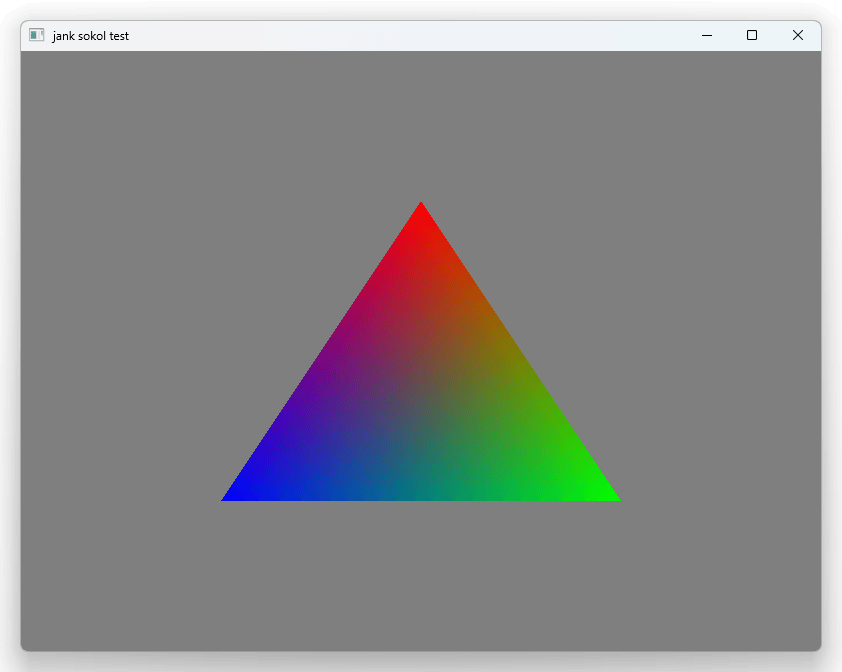

# jank sokol test

Forked from https://github.com/cerff-gur-sheel/SokolTriangle_CPP



Tested on Win/Mac/Linux (windows ver is checked using [jank-win](https://github.com/ikappaki/jank-win), mac/linux is used brew/apt, see [#installation](https://book.jank-lang.org/getting-started/01-installation.html))

## Run

```bash
# win
$ clang++ -shared -o lib/libapp.dll cpp_src/app.cpp -Iinclude -std=c++20

# linux
$ clang++ -shared -o lib/libapp.so cpp_src/app.cpp -Iinclude -std=c++20 -fPIC

# mac
$ clang++ -shared -o lib/libapp.dylib cpp_src/app.mm -Iinclude -std=c++20 -lobjc -framework CoreFoundation -framework OpenGL -framework IOKit -framework Cocoa

$ lein run
```

## Dev

If needed for dev. Already included.

### Compile shaders

```bash
$ sokol-shdc --slang=glsl430 -i shaders\basic.glsl -o include\basic.glsl.h
```
